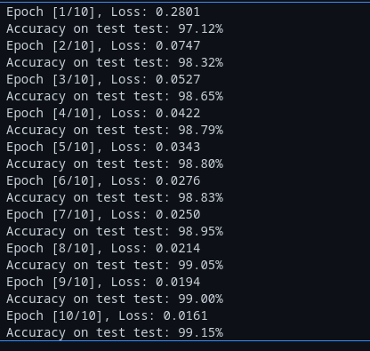
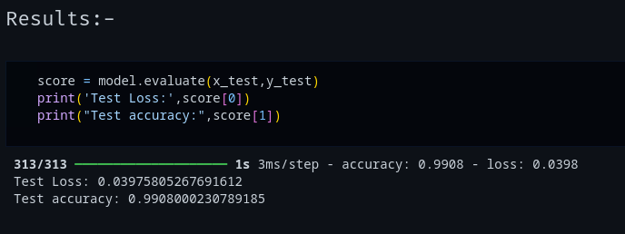

# 🖼️ CV Classification Backbones

A hands-on learning repository implementing **classic and modern image classification backbones** from scratch in both **PyTorch** and **TensorFlow**.
The goal of this repo is to build a solid understanding of how popular computer vision architectures are structured, trained, and compared across frameworks.

---

## 📂 Current Contents

* **LeNet/**

  * `LeNet5_mnist_torch.ipynb` → LeNet implementation using PyTorch
  * `LeNet5_mnist_tf.ipynb` → LeNet implementation using TensorFlow

---

## 📌 Planned Architectures

This repo will grow to include implementations of:

* ✅ **LeNet** (PyTorch & TensorFlow)
* 🔄 **AlexNet** (coming soon)
* 🔄 **VGGNet**
* 🔄 **Inception**
* 🔄 **ResNet**

Each architecture will have **two versions**: one in **PyTorch** and one in **TensorFlow** for comparison.

---

## 🧪 Results

### LeNet Results

* **PyTorch (10 epochs)** → **99.15%** accuracy
* **TensorFlow (20 epochs)** → **99.08%** accuracy

📊 Screenshots:

  
*LeNet – PyTorch (10 epochs, 99.15% accuracy)*  

  
*LeNet – TensorFlow (20 epochs, 99.08% accuracy)*

✅ **PyTorch achieved slightly higher accuracy (99.15% vs 99.08%) with fewer epochs.**

---

### Results Table

| Model | Framework  | Epochs | Accuracy   | Best |
| ----- | ---------- | ------ | ---------- | ---- |
| LeNet | PyTorch    | 10     | **99.15%** | ✅    |
| LeNet | TensorFlow | 20     | 99.08%     |      |

---

## 🛠️ Tech Stack

* **Python 3**
* **PyTorch**
* **TensorFlow / Keras**
* **NumPy**
* **Matplotlib**

---

## 🎯 Purpose

* 📚 To learn how classification backbones are built from scratch.
* ⚡ To compare implementations across frameworks (PyTorch vs TensorFlow).
* 🧠 To understand design choices behind classic and modern CNNs.
* 🚀 To create a reference repo for interview prep and future projects.

---

## 📜 License

This project is licensed under the [MIT License](LICENSE).

---

## 👤 Author

**bhupen** – *Exploring deep learning one architecture at a time*
🔗 [LinkedIn](https://www.linkedin.com/in/bhupenparmar/) | [GitHub](https://github.com/bhupencoD3)
