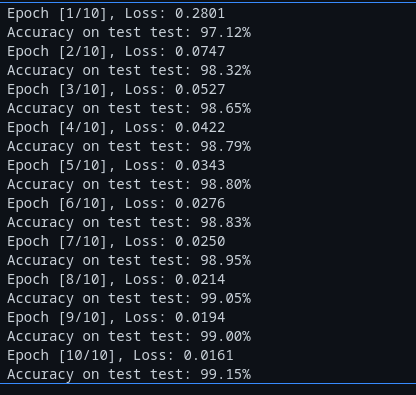
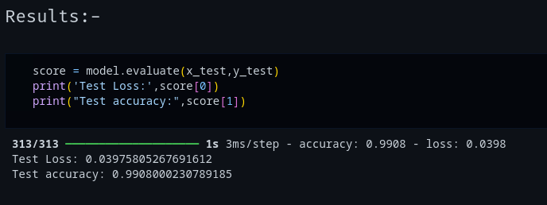
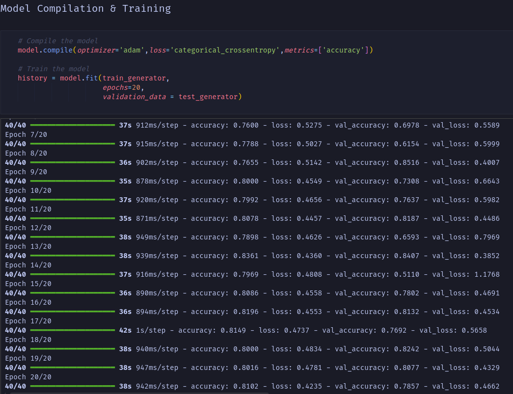
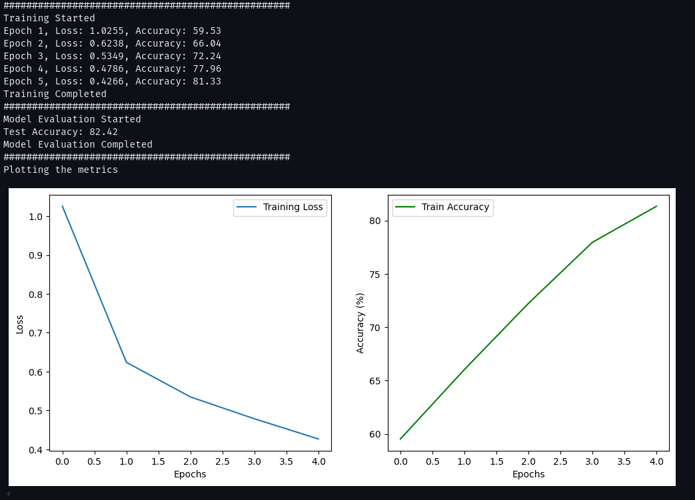

# 🖼️ CV Classification Backbones

A hands-on learning repository implementing **classic and modern image classification backbones** from scratch in both **PyTorch** and **TensorFlow**.
The goal of this repo is to build a solid understanding of how popular computer vision architectures are structured, trained, and compared across frameworks.

---

## 📂 Current Contents

* **LeNet/**

  * `LeNet5_mnist_torch.ipynb` → LeNet implementation using PyTorch
  * `LeNet5_mnist_tf.ipynb` → LeNet implementation using TensorFlow

* **AlexNet/**

  * `AlexNet_tf.ipynb` → AlexNet implementation using TensorFlow trained on custom Daisy vs Dandelion dataset
  * `AlexNet_torch.ipynb` → AlexNet implementation using PyTorch trained on custom Daisy vs Dandelion dataset

* **VGG/**

  * `vgg_pretrained_tf.ipynb` → Pretrained VGG16 & VGG19 (TensorFlow/Keras) with ImageNet inference
  * `vgg_pretrained_torch.ipynb` → Pretrained VGG16 (PyTorch) with ImageNet inference

* **Inception/**

  * `inception_tf.ipynb` → InceptionV3 implementation using TensorFlow/Keras pretrained on ImageNet
  * `inception_torch.ipynb` → InceptionV3 implementation using PyTorch pretrained on ImageNet with top-5 inference visualization
  * `inception_transfer_learning.ipynb` → InceptionV3 transfer learning on CIFAR-10 with validation accuracy visualization

---

## 📌 Planned Architectures

This repo currently includes:

* ✅ **LeNet** (PyTorch & TensorFlow)
* ✅ **AlexNet** (PyTorch & TensorFlow)
* ✅ **VGG (Pretrained – TensorFlow & PyTorch)**
* ✅ **Inception (TensorFlow & PyTorch)**
* 🔄 **ResNet** (coming soon)

Each architecture has **two versions**: PyTorch and TensorFlow where applicable.

---

## 🧪 Results

### LeNet Results

* **PyTorch (10 epochs, MNIST)** → **99.15%** accuracy
* **TensorFlow (20 epochs, MNIST)** → **99.08%** accuracy

📊 Screenshots:

*LeNet – PyTorch (10 epochs, 99.15% accuracy)*

*LeNet – TensorFlow (20 epochs, 99.08% accuracy)*

---

### AlexNet Results

* **TensorFlow (20 epochs, Daisy vs Dandelion Custom Dataset)** → **0.8102 accuracy**
* **PyTorch (5 epochs, Daisy vs Dandelion Custom Dataset)** → **82.42% accuracy*

📊 Screenshots:

*AlexNet – TensorFlow (20 epochs, 0.8102 accuracy)*

*AlexNet – PyTorch (5 epochs, 82.42% accuracy)*

---

### Inception Results

* **TensorFlow (Pretrained ImageNet)** → Top-5 predictions demonstrated for sample images
* **PyTorch (Pretrained ImageNet)** → Top-5 predictions demonstrated for sample images
* **Transfer Learning (CIFAR-10)** → Validation accuracy ~0.7392 over 10 epochs

📊 Screenshots:

*Inception Transfer Learning – TensorFlow CIFAR-10 validation accuracy*

> ⚠️ Screenshots for Inception PyTorch and other results will be added soon.

---

### Results Table

| Model     | Framework  | Dataset                      | Epochs | Accuracy / Notes | Best |
| --------- | ---------- | ---------------------------- | ------ | ---------------- | ---- |
| LeNet     | PyTorch    | MNIST                        | 10     | **99.15%**       | ✅    |
| LeNet     | TensorFlow | MNIST                        | 20     | 99.08%           |      |
| AlexNet   | TensorFlow | Daisy vs Dandelion (Custom)  | 20     | 0.8102           |      |
| AlexNet   | PyTorch    | Daisy vs Dandelion (Custom)  | 5      | **82.42%**       | ✅    |
| VGG16     | TensorFlow | Pretrained ImageNet          | N/A    | Inference        | ✅    |
| VGG16     | PyTorch    | Pretrained ImageNet          | N/A    | Inference        | ✅    |
| Inception | TensorFlow | Pretrained ImageNet          | N/A    | Sample inference | ✅    |
| Inception | PyTorch    | Pretrained ImageNet          | N/A    | Sample inference | ✅    |
| Inception | TensorFlow | CIFAR-10 (Transfer Learning) | 10     | 0.7392 val_acc   |      |

---

## 🛠️ Tech Stack

* **Python 3**
* **PyTorch**
* **TensorFlow / Keras**
* **Torchvision**
* **NumPy**
* **Matplotlib**
* **PIL (Pillow)**

---

## 🎯 Purpose

* 📚 Learn how classification backbones are built from scratch
* ⚡ Compare implementations across frameworks (PyTorch vs TensorFlow)
* 🧠 Understand design choices behind classic and modern CNNs
* 🚀 Create a reference repo for **interview prep** and future projects

---

## 📜 License

This project is licensed under the [MIT License](LICENSE).

---

## 👤 Author

**bhupen** – *Building and benchmarking deep learning backbones for computer vision*
🔗 [LinkedIn](https://www.linkedin.com/in/bhupenparmar/) | [GitHub](https://github.com/bhupencoD3)
